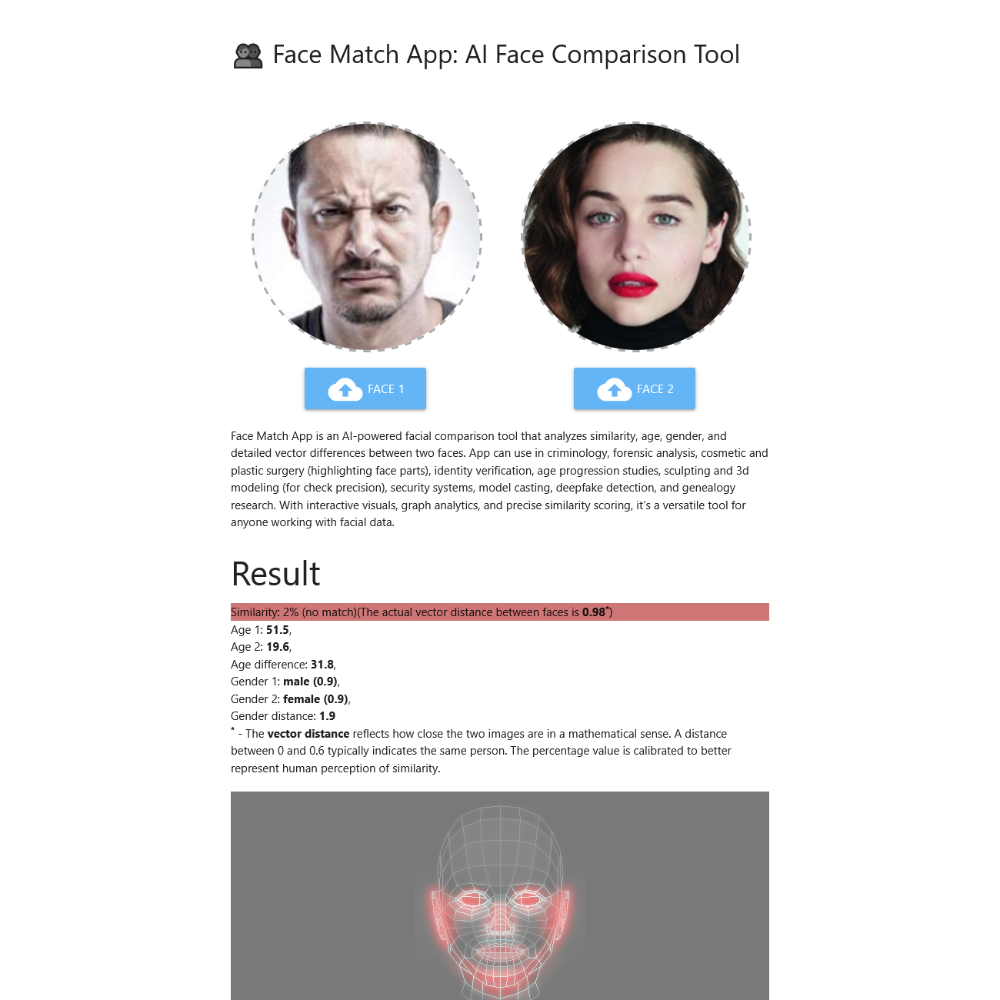
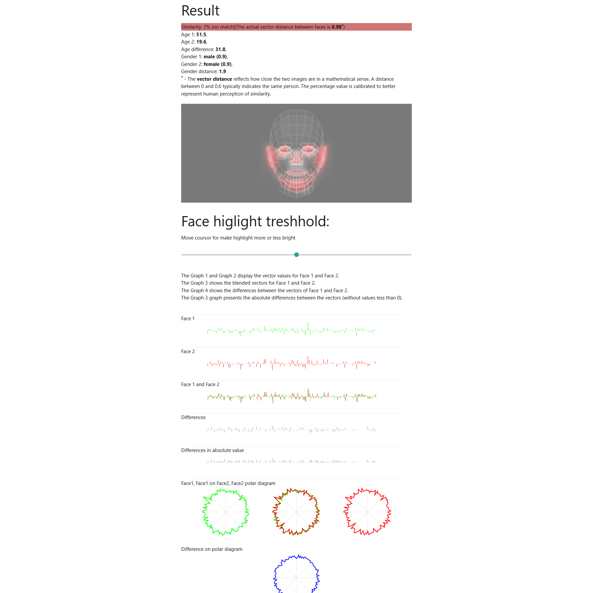

# Face Match App
Face Match App is an AI-powered facial comparison tool that analyzes similarity, age, gender, and detailed vector differences between two faces. 

Try online https://neuromodern.github.io/face-match-app/

Based on tensorFlow.js and face-api.js

App can use in criminology, forensic analysis, cosmetic and plastic surgery (highlighting face parts), identity verification, age progression studies, sculpting and 3d modeling (for check precision), security systems, model casting, deepfake detection, and genealogy research. With interactive visuals, graph analytics, and precise similarity scoring, it’s a versatile tool for anyone working with facial data. 

